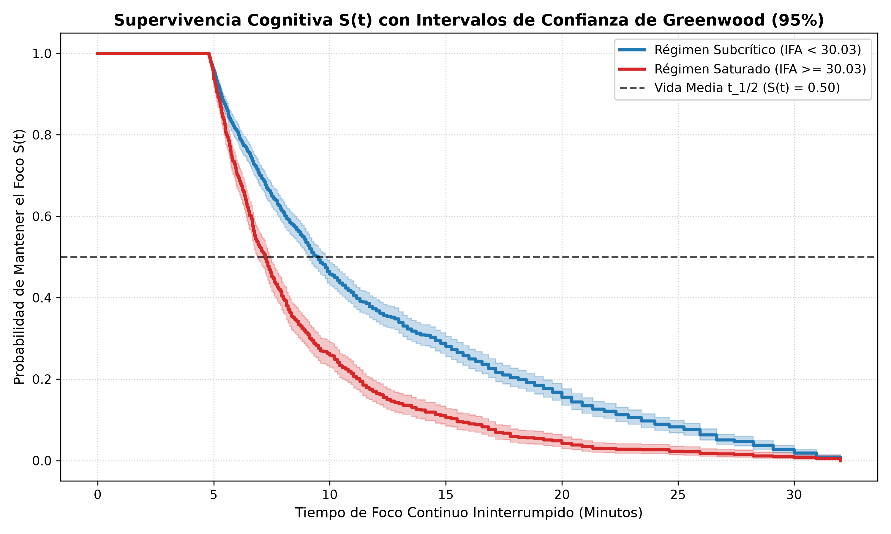
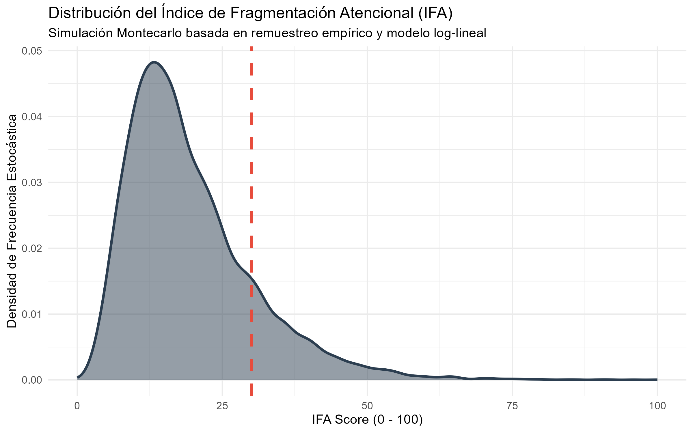

# Attention Economy: Neuro-Stochastic Modeling of Cognitive Fragmentation in Digital Interfaces

<p align="center">


</p>

<p align="center">
  <strong>Independent statistical research on digital attention fragmentation, cognitive productivity, nonlinear saturation thresholds, and stochastic interruption dynamics.</strong>
</p>

<p align="center">
  <em>Data Engineering · Econometrics · Statistical Modeling · Stochastic Processes · Survival Analysis · Machine Learning</em>
</p>

---

## Abstract

Digital interfaces have transformed the way students communicate, study, consume information, and allocate attention. This project investigates the quantitative relationship between **digital interaction behavior, attentional fragmentation, and cognitive productivity** within a student population using an end-to-end statistical and data-engineering pipeline.

The empirical foundation is the **Mobile Phone Screen Time Dataset (Baig, 2025)**. From the original dataset, a strict data-engineering pipeline was applied to isolate the student cohort and obtain a final analytical sample of **N = 2,023 observations**. The pipeline was implemented primarily with **Python, Polars, SQL, Pandas, Statsmodels, Scikit-learn, SciPy, and R**.

A central component of the research is the construction of the **Attention Fragmentation Index (IFA)**, a synthetic behavioral index designed to quantify exposure to digital interruption. The index combines four standardized indicators of digital interaction:

* Daily screen time
* Social media usage
* Application notifications
* Daily screen unlock frequency

Rather than assigning arbitrary weights, the study applies **Principal Component Analysis (PCA)** to the standardized correlation matrix of these variables and uses the first principal component to construct the index. The resulting IFA is subsequently rescaled to a **0–100 operational scale**.
The primary econometric specification is a **standardized multiple linear regression estimated by Ordinary Least Squares (OLS)**:

[
Y_i = \beta_0 + \beta_1 IFA_i + \beta_2 ZStress_i + \beta_3 ZSleep_i + \varepsilon_i
]

where cognitive productivity is modeled as the dependent variable, IFA is the principal explanatory variable, and basal stress and sleep are included as physiological controls.

The primary regression identifies IFA as the dominant empirical predictor within the specified model:

[
\beta_{IFA} = -0.8060,\qquad p < 0.001
]

with an overall:

[
R^2 = 0.6509
]

and:

[
Adjusted\ R^2 = 0.6508
]

The standardized interpretation is that a one-standard-deviation increase in IFA is associated with an estimated **0.806-standard-deviation decrease in the modeled cognitive productivity measure**, conditional on the included controls.

The analysis then moves beyond the linear model. A **non-parametric Bootstrap Monte Carlo simulation with 10,000 iterations** was used to stress the empirical distribution and investigate nonlinear behavior. This procedure identified an operational threshold at:

[
IFA^* = 30.03
]

corresponding to approximately the **85th percentile** of the empirical IFA distribution.

The threshold was independently evaluated using a **Chow structural-break test**, producing:

[
F = 132.55
]

[
p = 1.11\times10^{-16}
]

The result rejects the hypothesis of parameter stability across the threshold and supports the use of two empirical regimes:

```text
Subcritical Regime     → IFA < 30.03
Saturated Regime       → IFA ≥ 30.03
```

The sample is therefore divided into **1,720 observations in the subcritical regime** and **303 observations in the saturated regime**.

The project further extends the analysis into **out-of-sample validation, Kaplan-Meier survival analysis, Greenwood confidence intervals, Cox proportional hazards, Non-Homogeneous Poisson Processes (NHPP), and bivariate Kernel Density Estimation (KDE)**. These complementary methods provide a multidimensional view of the relationship between digital fragmentation, sustained attention, interruption dynamics, and modeled productivity.

This repository therefore represents an attempt to move from a conventional statistical assignment toward a complete analytical system:

```text
Raw Data
   ↓
ETL & Data Quality
   ↓
Feature Engineering
   ↓
PCA-Based IFA
   ↓
Econometric Estimation
   ↓
Model Diagnostics
   ↓
Nonlinear / Stochastic Modeling
   ↓
Structural Break Analysis
   ↓
Out-of-Sample Audit
   ↓
Survival Analysis
   ↓
Process Modeling
   ↓
Statistical Visualization
   ↓
Research Interpretation
```

---

# Research Context

## The Problem

The project begins from a contemporary concern within the **attention economy**: digital interfaces increasingly expose students to frequent notifications, social-media feeds, screen checks, and repeated interruptions.

The research question is not simply whether students use their phones frequently.

The deeper question is:

> **Does the structure and frequency of digital interruption correspond to measurable changes in sustained attention and cognitive productivity within the empirical sample?**

The conceptual framework integrates econometrics with cognitive-attention theory.

The study uses the **Posner and Rothbart attention-network framework** as an interpretive structure involving:

* **Alerting Network**
* **Orienting Network**
* **Executive Network**

At a broader systems level, the study also discusses the interaction between:

* **Default Mode Network (DMN)**
* **Central Executive Network (CEN)**
* **Salience Network (SN)**

The project uses these frameworks as theoretical interpretation rather than claiming to directly observe neural activity. The study explicitly recognizes that the available variables come from smartphone telemetry and self-report rather than fMRI, EEG, or other direct neurophysiological instrumentation.

---

# Research Questions

The study is organized around four principal research questions.

### 1. Digital determinants of fragmentation

How strongly are daily screen time, social-media usage, application notifications, and screen-unlock frequency associated with attentional fragmentation in the student population?

### 2. Construction of a quantitative index

Can these behavioral indicators be integrated into a statistically interpretable **Attention Fragmentation Index (IFA)** using a reproducible dimensional-reduction methodology?

### 3. Nonlinear behavior and critical thresholds

Does the relationship between attentional fragmentation and modeled productivity remain approximately linear throughout the observed range, or does the empirical system exhibit a critical threshold beyond which the relationship changes regime?

### 4. Dynamic interruption mechanisms

How do interruption frequency, sustained-attention survival, task-switching dynamics, and intraday event intensity interact within the modeled system?

---

# Research Objectives

## General Objective

To evaluate the empirical association between digital-consumption determinants, attentional fragmentation, and cognitive productivity within a student cohort of **N = 2,023**, using standardized OLS estimation and stochastic nonlinear modeling to identify operational thresholds of fragmentation.

## Specific Objectives

1. Operationalize digital-interaction variables within the theoretical architecture of attentional networks.
2. Construct a synthetic Attention Fragmentation Index using standardized variables and PCA.
3. Estimate the relationship between IFA and cognitive productivity through multivariable OLS.
4. Evaluate core econometric assumptions through formal diagnostics.
5. Stress-test the empirical distribution through non-parametric Bootstrap Monte Carlo simulation.
6. Identify a potential nonlinear threshold in the observed fragmentation scale.
7. Test parameter stability using the Chow structural-break methodology.
8. Audit the IFA reconstruction pipeline using a 90/10 out-of-sample split.
9. Model sustained attention as a time-to-event process using Kaplan-Meier survival analysis.
10. Estimate the relationship between IFA and instantaneous attentional failure risk using a Cox model.
11. Model intraday interruption arrivals using a Non-Homogeneous Poisson Process.
12. Map the joint topology of IFA and productivity using bivariate Kernel Density Estimation.
13. Translate the empirical findings into potential individual, institutional, and interface-level interventions.

---

# Dataset

## Source

**Mobile Phone Screen Time Dataset — Baig (2025)**

The original secondary dataset contains approximately:

```text
10,000 observations
```

The research pipeline applies a targeted filtering and data-quality protocol to obtain:

```text
Final analytical sample = 2,023 student observations
```

The target cohort corresponds to students within the **18–25 age range**. The filtering process removes non-student profiles and observations that violate physical or logical constraints.

---

# Data Engineering Pipeline

The project was intentionally designed as an **ETL and modeling pipeline**, rather than a single exploratory notebook.

## Pipeline Architecture

```text
                 ORIGINAL DATASET
                 N ≈ 10,000
                       │
                       ▼
              Cohort Segmentation
                       │
                       ▼
             Data Quality Filtering
                       │
                       ▼
               Outlier Detection
                       │
                       ▼
                Standardization
                       │
                       ▼
             PCA / Feature Synthesis
                       │
                       ▼
                 IFA [0,100]
                       │
            ┌──────────┼──────────┐
            ▼          ▼          ▼
           OLS      Monte Carlo   OOS
            │          │          │
            ▼          ▼          ▼
        Diagnostics  Threshold  Validation
            │
            ▼
       Structural Break
            │
     ┌──────┼───────────────┐
     ▼      ▼               ▼
 Kaplan-Meier   Cox         NHPP
     │                          │
     └──────────┬───────────────┘
                ▼
             KDE / Interpretation
```

## ETL principles

The data-preparation stage includes:

* Student cohort filtering
* Age-range restriction
* Removal of physically impossible observations
* Outlier treatment using an IQR-based criterion
* Standardization of behavioral variables
* SQL-based transformations
* Columnar processing with Polars

The project therefore treats data quality as a formal methodological stage rather than as an afterthought.

---

# Feature Engineering

The main digital-interaction variables are:

| Variable                     | Interpretation within the study                 |
| ---------------------------- | ----------------------------------------------- |
| `Daily_Screen_Time_Hours`    | Total daily active screen exposure              |
| `Social_Media_Usage_Hours`   | Exposure to continuous social-media interaction |
| `App_Notifications_Received` | Frequency of external digital interruptions     |
| `Screen_Unlocks_Per_Day`     | Frequency of voluntary device checking          |

These variables are first standardized and then combined through PCA.

---

# Attention Fragmentation Index — IFA

## Why construct an index?

The individual variables capture different dimensions of digital interaction:

```text
Screen time       → exposure duration
Social media      → continuous reorientation
Notifications     → external interruption
Screen unlocks    → voluntary interruption/checking
```

Analyzing each variable independently can obscure their shared latent structure.

The IFA was therefore designed as a synthetic behavioral measure intended to capture the common information contained in the four digital-interaction indicators.

---

# PCA-Based Construction

The study applies **Principal Component Analysis** to the correlation matrix of the standardized variables.

The first principal component is used as the primary latent dimension because it captures the largest share of common variation across the digital-interaction system.

Conceptually:

```text
Z(Screen Time)
        │
Z(Social Media) ──┐
                  ├──► PCA ───► PC1 ───► IFA
Z(Notifications) ─┤
                  │
Z(Screen Unlocks) ┘
```

The index is represented as:

[
IFA_i =
w_1 ZUnlocks_i +
w_2 ZNotif_i +
w_3 ZSocial_i +
w_4 ZScreen_i
]

The resulting standardized score is transformed to a bounded operational scale:

[
0 \leq IFA \leq 100
]

using a min-max transformation.

The empirical sample has:

```text
Mean IFA = 18.42
SD       = 9.15
Critical IFA = 30.03
Percentile   = 85th
```

The threshold corresponds to approximately **+1.26 standard deviations relative to the empirical distribution after rescaling**.

---

# Construct Validity

A central methodological limitation is explicitly recognized:

> **The IFA is a behavioral proxy, not a direct neurophysiological measurement.**

The study does not claim that smartphone telemetry directly measures:

* cortical activation,
* neural connectivity,
* dopamine concentration,
* fMRI activity,
* EEG activity,
* or anatomical changes.

Instead, the theoretical neuroscience framework is used to interpret patterns in observable behavioral data.

This distinction is fundamental to the correct interpretation of the project.

---

# Primary Econometric Model

The principal model is a standardized multiple linear regression estimated using **Ordinary Least Squares (OLS)**.

[
Y_i = \beta_0 + \beta_1 IFA_i + \beta_2 ZStress_i + \beta_3 ZSleep_i + \varepsilon_i
]

Where:

| Symbol          | Meaning                              |
| --------------- | ------------------------------------ |
| (Y_i)           | Standardized cognitive productivity  |
| (IFA_i)         | Attention Fragmentation Index        |
| (ZStress_i)     | Standardized basal stress            |
| (ZSleep_i)      | Standardized sleep duration          |
| (\beta_j)       | Standardized regression coefficients |
| (\varepsilon_i) | Stochastic error term                |

The model allows the association between IFA and productivity to be examined while controlling for the two physiological covariates included in the specification.

---

# Main OLS Results

| Variable     | Coefficient | t-statistic |     p-value | Interpretation                  |
| ------------ | ----------: | ----------: | ----------: | ------------------------------- |
| Intercept    |      0.0000 |       0.000 |      1.0000 | Not significant                 |
| **IFA**      | **−0.8060** |  **−61.35** | **< 0.001** | **Strong negative association** |
| Basal Stress |      0.0009 |       0.070 |      0.9440 | Not significant                 |
| Sleep Hours  |     −0.0147 |      −1.115 |      0.2650 | Not significant                 |

### Global fit

```text
R²          = 0.6509
Adjusted R² = 0.6508
F(3, 2019)  = 1254.8
p-value     < 2.2 × 10⁻¹⁶
```

Within this specified multivariable model, IFA is by far the strongest standardized predictor of the productivity outcome.

---

# Interpretation of β₁

The estimated standardized coefficient is:

[
\beta_1 = -0.8060
]

Within the fitted model, a one-standard-deviation increase in IFA corresponds to an estimated **0.806-standard-deviation decrease in cognitive productivity**, conditional on the included stress and sleep controls.

The study deliberately interprets this as a **strong empirical association**, not as proof of causal determinism.

The report explicitly acknowledges the possibility of unobserved heterogeneity, including individual differences in baseline cognitive ability and personality traits.

---

# Econometric Diagnostics

The primary OLS specification was subjected to a battery of diagnostics.

## Linearity

Residual-versus-fitted diagnostics were interpreted as showing no obvious systematic nonlinear residual pattern within the primary specification.

## Homoscedasticity

Breusch-Pagan test:

```text
BP statistic = 2.955
p-value      = 0.3986
```

The null hypothesis of constant error variance is not rejected at conventional significance levels.

## Multicollinearity

Variance Inflation Factors:

```text
VIF(IFA)    = 1.0034
VIF(Stress) = 1.0028
VIF(Sleep)  = 1.0031
```

These values indicate extremely low collinearity among the modeled regressors.

## Residual Independence

Durbin-Watson:

```text
DW = 2.0082
```

This is close to the theoretical value of 2 and is interpreted in the study as evidence against first-order serial correlation.

## Residual Normality

Jarque-Bera:

```text
JB = 14.28
p-value = 0.0008
```

Strict residual normality is therefore rejected.

The report addresses this through asymptotic reasoning based on the large sample size rather than pretending that the normality assumption was perfectly satisfied.

---

# Theoretical Interpretation

The model is interpreted through three complementary conceptual frameworks.

## Posner & Rothbart

The project maps digital behaviors to three attentional systems:

### Alerting Network

Operationalized conceptually through notification frequency and external digital alerts.

### Orienting Network

Associated conceptually with continuous visual exploration and social-media navigation.

### Executive Network

Associated conceptually with voluntary task control, inhibition, and repeated screen checking.

At the macro-network level, the study discusses:

```text
DMN ↔ Salience Network ↔ CEN
```

as a conceptual framework for understanding transitions between internally directed cognition and task-oriented processing.

---

# Task Switching and Attentional Residue

The work incorporates the task-switching framework associated with **Gloria Mark**.

The central interpretation is that repeated digital interruptions impose switching costs and require cognitive resources to reconstruct the context of the interrupted task.

The project uses the study's empirical interruption pattern of approximately **one device unlock every 7.5 minutes in the modeled high-risk group** to illustrate the potential mismatch between interruption frequency and sustained analytical work.

---

# Popcorn Brain Framework

The study also uses David Levy's concept of **"Popcorn Brain"** as a conceptual interpretation of highly fragmented digital environments.

The framework is represented as:

```text
Accelerated Digital Environment
            ↓
Attentional Threshold Desynchronization
            ↓
Popcorn Brain
            ↓
Reduced Tolerance for Slow / Complex Tasks
            ↓
Difficulty Sustaining Deep Work
```

Importantly, this framework is treated as a **theoretical interpretation of the statistical results**, not as a directly measured neurological diagnosis.

---

# Nonlinear Modeling

The OLS model provides a first-order linear approximation.

However, the project does not assume that the relationship between fragmentation and cognitive performance remains linear over the entire observed range.

To investigate this possibility, a **non-parametric Bootstrap Monte Carlo simulation with 10,000 iterations** was developed.

---

# Monte Carlo / Bootstrap Simulation

The simulation repeatedly re-samples the empirical student population with replacement.

```text
Observed Sample
N = 2,023
      │
      ▼
Bootstrap Resampling
      │
      ├── Iteration 1
      ├── Iteration 2
      ├── ...
      └── Iteration 10,000
      │
      ▼
Empirical Distribution of Parameters
      │
      ▼
Threshold / Regime Analysis
```

The procedure is designed to evaluate:

* parameter stability,
* empirical variability,
* simulated coefficients,
* operational threshold behavior,
* and nonlinear regime transitions.

The report explicitly states that the Bootstrap is **not intended to function as a universal predictor of the global university population**. It acts instead as an empirical stochastic stress-testing mechanism on the observed distribution.

---

# Critical Threshold: IFA = 30.03

The simulation identifies:

[
IFA^* = 30.03
]

which corresponds to approximately the **85th percentile** of the empirical distribution.

This produces two operational regimes:

| Regime          | Definition    | Observations |
| --------------- | ------------- | -----------: |
| **Subcritical** | `IFA < 30.03` |        1,720 |
| **Saturated**   | `IFA ≥ 30.03` |          303 |

## The threshold represents the point at which the study's stochastic response function indicates a substantial change in modeled attentional behavior.

# Structural Break Analysis

To independently assess whether the relationship changes across the threshold, the study implements a **Chow structural-break test**.

## Hypotheses

[
H_0:
\beta_{IFA<30.03}
=================

\beta_{IFA\geq30.03}
]

versus

[
H_1:
\beta_{IFA<30.03}
\neq
\beta_{IFA\geq30.03}
]

## Result

```text
Chow F-statistic = 132.55
p-value           = 1.11 × 10⁻¹⁶
```

The null hypothesis of parameter stability is rejected.

Within the empirical framework of the study, this provides evidence that the relationship between IFA and the productivity outcome is not homogeneous across the full IFA range.

---

# Out-of-Sample Audit

The IFA reconstruction pipeline was subjected to a **90/10 train-test split**.

```text
Training sample = 1,820
Testing sample  =   203
```

The test sample remained isolated during model fitting and was used as a blind audit set.

## Out-of-Sample Results

```text
R² OOS = 0.9876
RMSE   = 0.1109 SD
```

These metrics indicate very high out-of-sample reconstruction consistency for the **synthetic IFA within the study's pipeline**. The result should be interpreted specifically as an audit of the index-estimation pipeline rather than as evidence that the study can universally predict future cognitive outcomes.

---

# Attention Stability and Focus Decay

The project models sustained attention as a process whose stability changes between the two IFA regimes.

## Conditional focus-life estimates

| Regime      | Modeled focus-life estimate |
| ----------- | --------------------------: |
| IFA < 30.03 |                    8.39 min |
| IFA ≥ 30.03 |                    6.20 min |

The difference corresponds to an estimated **26.0% reduction** in the conditional focus-life measure.

The report explicitly distinguishes these conditional/parametric estimates from the later non-parametric Kaplan-Meier medians.

---

# Queueing Interpretation of Re-Engagement Debt

The project also introduces a queueing interpretation of interruption and cognitive re-engagement.

Under the saturated regime, the modeled system produces an equivalent cumulative re-engagement workload of:

```text
32.15 hours/day equivalent
```

This value is **not literal chronological time**.

It represents a queueing-theoretic accumulation of unresolved cognitive-processing workload in an M/M/1-style interpretation where the modeled interruption arrival rate exceeds the modeled processing rate.

In other words:

```text
Arrival Rate λ > Processing Rate μ
                ↓
Accumulated Residual Work
                ↓
Cognitive Overlap
                ↓
Non-Stationary Saturation
```

The report explicitly defines the 32.15-hour figure as a stochastic queueing equivalent rather than literal time lost from a 24-hour day.

---

# Logistic Academic-Success Model

A binary logistic model was introduced to estimate the conditional probability of maintaining productivity above the sample mean.

The study models:

[
P(Y_i=1|IFA_i,X_i)
==================

\frac{1}
{1+e^{-(\beta_0+\beta_1IFA_i+\gamma X_i)}}
]

where academic success is operationalized as productivity at or above the sample mean.

## Modeled regime probabilities

| Regime      | Probability of modeled academic success |
| ----------- | --------------------------------------: |
| IFA < 30.03 |                               **73.3%** |
| IFA ≥ 30.03 |                               **16.3%** |

Difference:

```text
57.0 percentage points
```

The model reports:

```text
IFA = 10.0   → 98.4%
IFA = 30.03  → 37.0%
IFA = 50.0   →  0.6%
```

These should be interpreted as **conditional model estimates within the empirical study**, not as universal probabilities for all university students.

---

# Age-Cohort Analysis

The study additionally explores attentional resistance across age cohorts within the 18–25 student population.

Within the modeled saturated regime:

```text
Age < 20 years     → 7.59 minutes
Age ≥ 22 years     → 7.22 minutes
```

The absolute difference is approximately:

```text
22 seconds
```

or roughly:

```text
5.1%
```

The study interprets this small difference as evidence that the saturated regime may reduce the practical separation between the age groups in the observed sample.

---

# Extreme Fragmentation

The report estimates that:

```text
4.4%
```

of the total student sample operates with continuous-attention windows below five minutes.

Within the study's operational framework, this subgroup represents the extreme end of attentional fragmentation.

---

# Survival Analysis

The research treats sustained attention as a **time-to-event problem**.

The event of interest is the interruption / collapse of sustained focus.

The survival function is:

[
S(t)=P(T>t)
]

where (T) represents the time until attentional failure.

The analysis integrates:

* Kaplan-Meier estimation
* Greenwood variance
* Confidence intervals
* Cox proportional hazards

---

# Kaplan-Meier Results

The strict non-parametric median survival times are:

| Regime      | Kaplan-Meier median |
| ----------- | ------------------: |
| IFA < 30.03 |        **9.50 min** |
| IFA ≥ 30.03 |        **7.22 min** |

Difference:

```text
2.28 minutes
24.0% reduction
```

The two-regime survival curves visually demonstrate the faster decline in sustained-focus probability under the saturated regime.

### Survival curve



---

# Greenwood Confidence Intervals

Greenwood's formula was used to estimate uncertainty around the Kaplan-Meier survival function.

For a selected point in the saturated regime:

```text
t = 4.97 min
n at risk = 756
events = 10

S(t) = 0.9479
SE    = 0.0079
95% CI = [0.9323, 0.9634]
```

The narrow interval reflects the estimated precision of the survival function at that point in the empirical sample.

---

# Cox Proportional Hazards Model

The study also models the instantaneous hazard of attentional interruption as a function of IFA.

The Cox specification is:

[
h(t|IFA)=h_0(t)\exp(\beta IFA)
]

Estimated coefficient:

```text
β = 0.0345
SE = 0.0026
z = 13.52
p = 1.14 × 10⁻⁴¹
```

Hazard Ratio:

```text
HR = 1.0351
```

Therefore, within the fitted model:

```text
+1 IFA point
      ↓
~3.51% increase in instantaneous hazard
```

For a +10-point IFA increase:

```text
HR₁₀ = 1.4124
```

corresponding to approximately:

```text
+41.24%
```

in the modeled instantaneous hazard.

---

# Important Cox Model Limitation

The proportional-hazards assumption was formally evaluated with Schoenfeld residuals.

Result:

```text
p = 0.0421
```

At the 5% significance level, this indicates a formal violation of the proportional-hazards assumption.

Rather than treating this as a hidden flaw, the project incorporates it into the interpretation:

> The estimated effect of IFA may not remain constant across time.

This motivates the transition toward dynamic models such as the **Non-Homogeneous Poisson Process**, where interruption intensity is explicitly allowed to vary over the course of the day.

---

# Non-Homogeneous Poisson Process — NHPP

Digital interruptions are not treated as a constant-rate event process.

The project therefore models interruption arrivals using a **Non-Homogeneous Poisson Process**:

[
NHPP(\lambda(t))
]

where the event intensity varies as a function of time.

The modeled active window is:

```text
06:00 AM → 11:00 PM
```

and the expected accumulated number of events follows:

[
E[N(t)] = \int_0^t \lambda(u),du
]

---

# Intraday Interruption Dynamics

The modeled intensity function exhibits three major peaks:

| Time         | Approx. intensity |
| ------------ | ----------------: |
| **09:30 AM** |  15.5 events/hour |
| **03:30 PM** |  18.8 events/hour |
| **09:30 PM** |  22.0 events/hour |

The cumulative modeled interruption volumes are:

| Regime      | Interruptions/day |
| ----------- | ----------------: |
| IFA < 30.03 |           **184** |
| IFA ≥ 30.03 |           **230** |

Difference:

```text
+46 interruptions/day
+25.0%
```

within the modeled regimes.

---

# Bivariate Kernel Density Estimation

A Gaussian bivariate Kernel Density Estimation was used to investigate the joint topology of:

```text
IFA × Cognitive Productivity
```

The analysis models the joint density:

[
f(IFA,Y)
]

where (Y) represents adjusted cognitive productivity.

---

# KDE Interpretation

The modeled density reveals three broad regions:

### High-density / low-fragmentation region

For:

```text
IFA < 20
```

the highest-density region is concentrated around:

```text
Productivity Y ≥ 80
```

### Critical region

Near:

```text
IFA = 30.03
```

the modeled density of high-productivity observations declines sharply.

### Extreme fragmentation region

For:

```text
IFA ≥ 50
```

the modeled distribution becomes concentrated in low-productivity values.

The KDE therefore provides a visual/topological complement to the OLS and regime-based analyses.

---

# Monte Carlo Distribution



The Monte Carlo distribution provides the stochastic perspective of the project, highlighting the empirical concentration of IFA values and the location of the operational threshold.

The vertical threshold corresponds to:

```text
IFA* = 30.03
```

which lies at approximately the 85th percentile of the empirical sample.

---

# Cognitive Regime Comparison

The research synthesizes its principal regime-level indicators into a comparative framework.

| Dimension                            | Subcritical Regime | Saturated Regime |
| ------------------------------------ | -----------------: | ---------------: |
| IFA                                  |          `< 30.03` |        `≥ 30.03` |
| Conditional focus-life estimate      |           8.39 min |         6.20 min |
| Kaplan-Meier median                  |           9.50 min |         7.22 min |
| Re-engagement latency                |            3.5 sec |         18.2 min |
| Executive Avoidance Index            |               0.15 |             0.88 |
| Modeled academic-success probability |              73.3% |            16.3% |

The report summarizes these differences as evidence of a substantial transition between empirical operating regimes within the observed population.

---

# Executive Avoidance Index — IEE

The project defines an additional metric intended to represent the modeled tendency to avoid cognitively demanding tasks under digital-interruption pressure.

[
IEE =
1 -
\frac{T_{High\ Load}}
{T_{Expected\ Micro\text{-}Interruptions}}
]

Reported values:

```text
Subcritical → IEE = 0.15
Saturated   → IEE = 0.88
```

The measure is interpreted as a modeled index of avoidance / task disengagement rather than a direct neurophysiological measurement.

---

# Network Switching Energy — NSE

The research also introduces the Network Switching Energy concept:

[
NSE =
\gamma_0
\cdot
e^{\alpha IFA}
\cdot
\Delta\tau_{DMN\rightarrow CEN}
]

The modeled re-engagement latency is presented as:

```text
Lower-fragmentation state → 3.5 seconds
Saturated regime           → 18.2 minutes
```

The study compares this re-engagement latency with the estimated focus-life values to illustrate the concept of a **residual-attention bottleneck**: interruptions can arrive before the modeled system has sufficient time to fully reconstruct task context.

---

# Key Findings at a Glance

<table>
<tr>
<th>Metric</th>
<th>Result</th>
<th>Interpretation</th>
</tr>

<tr>
<td><strong>Sample</strong></td>
<td><strong>N = 2,023</strong></td>
<td>Final student cohort after ETL and data cleaning</td>
</tr>

<tr>
<td><strong>IFA coefficient</strong></td>
<td><strong>β = −0.8060</strong></td>
<td>Strong negative standardized association in the OLS model</td>
</tr>

<tr>
<td><strong>Adjusted R²</strong></td>
<td><strong>0.6508</strong></td>
<td>Approx. 65% of modeled productivity variance explained</td>
</tr>

<tr>
<td><strong>Critical IFA</strong></td>
<td><strong>30.03</strong></td>
<td>Empirical P85 operational threshold</td>
</tr>

<tr>
<td><strong>Chow test</strong></td>
<td><strong>F = 132.55</strong></td>
<td>Strong evidence against parameter stability across regimes</td>
</tr>

<tr>
<td><strong>OOS IFA reconstruction</strong></td>
<td><strong>R² = 0.9876</strong></td>
<td>High held-out reconstruction consistency of the synthetic index</td>
</tr>

<tr>
<td><strong>OOS RMSE</strong></td>
<td><strong>0.1109 SD</strong></td>
<td>Low reconstruction error on the held-out sample</td>
</tr>

<tr>
<td><strong>Kaplan-Meier median</strong></td>
<td><strong>9.50 → 7.22 min</strong></td>
<td>24% reduction across empirical regimes</td>
</tr>

<tr>
<td><strong>Cox HR</strong></td>
<td><strong>1.0351</strong></td>
<td>Modeled hazard increases with IFA</td>
</tr>

<tr>
<td><strong>NHPP volume</strong></td>
<td><strong>184 → 230/day</strong></td>
<td>25% difference in modeled interruption volume</td>
</tr>

<tr>
<td><strong>Modeled academic success</strong></td>
<td><strong>73.3% → 16.3%</strong></td>
<td>57-point conditional difference between regimes</td>
</tr>

<tr>
<td><strong>Extreme fragmentation</strong></td>
<td><strong>4.4%</strong></td>
<td>Students with modeled focus windows below 5 minutes</td>
</tr>

</table>

---

# Statistical Validation Summary

| Method                | Purpose                            | Result             |
| --------------------- | ---------------------------------- | ------------------ |
| OLS                   | Estimate multivariable association | βIFA = −0.8060     |
| Adjusted R²           | Global model fit                   | 0.6508             |
| Breusch-Pagan         | Heteroscedasticity                 | p = 0.3986         |
| VIF                   | Multicollinearity                  | max ≈ 1.003        |
| Durbin-Watson         | Residual dependence                | 2.0082             |
| Jarque-Bera           | Residual normality                 | p = 0.0008         |
| Bootstrap Monte Carlo | Stochastic stress testing          | 10,000 iterations  |
| Chow Test             | Structural break                   | F = 132.55         |
| OOS Validation        | IFA reconstruction                 | R² = 0.9876        |
| Kaplan-Meier          | Attention survival                 | 9.50 vs 7.22 min   |
| Greenwood             | Survival uncertainty               | 95% CI estimation  |
| Cox PH                | Hazard relationship                | HR = 1.0351        |
| Schoenfeld            | PH assumption                      | p = 0.0421         |
| NHPP                  | Intraday interruptions             | 3 modeled peaks    |
| KDE                   | Joint density topology             | IFA × productivity |

---

# Methodological Strengths

The project was intentionally designed around several principles.

## 1. Reproducible data engineering

The analysis starts with explicit filtering, cleaning and transformation rather than directly fitting models to raw data.

## 2. Data-driven index construction

The IFA weights are derived through PCA instead of being manually assigned.

## 3. Standardized econometric interpretation

The primary OLS coefficients are standardized, allowing direct comparison of predictor effects in standard-deviation units.

## 4. Formal diagnostic testing

The model is not accepted merely because of a high R². Multiple assumptions and potential failure modes are explicitly evaluated.

## 5. Nonlinear stress testing

Bootstrap Monte Carlo is used to investigate whether the empirical relationship may change behavior around a critical threshold.

## 6. Structural-break analysis

The threshold is subjected to an independent Chow test rather than being accepted solely from visual inspection.

## 7. Out-of-sample audit

The synthetic IFA construction is evaluated against observations excluded from model training.

## 8. Multiple stochastic frameworks

The project extends beyond static regression into survival analysis, hazard modeling, Poisson processes and KDE.

## 9. Explicit methodological caveats

The study acknowledges limitations rather than treating every statistical result as causal or universal.

---

# Methodological Limitations

A rigorous interpretation of this project requires several caveats.

### Observational design

The study is based on observational secondary data. The regression identifies associations within the empirical sample and does not establish causal effects by itself.

### Behavioral proxy

The IFA is a synthetic behavioral index based on mobile-use variables. It is not a direct measurement of neural activity.

### Potential unobserved heterogeneity

Differences in baseline cognitive ability, personality, socioeconomic conditions, academic workload, or other omitted variables may influence the observed relationships.

### Residual normality

The Jarque-Bera test rejects strict normality of the regression residuals:

```text
p = 0.0008
```

The report addresses this through asymptotic reasoning based on the large sample size.

### Cox proportional-hazards assumption

The Schoenfeld test produces:

```text
p = 0.0421
```

indicating a formal violation of the proportional-hazards assumption.

This is treated as evidence that the hazard relationship may vary over time.

### Monte Carlo scope

The Bootstrap simulation operates on the empirical distribution in the dataset and should not be interpreted as a universal simulator of global student behavior.

### OOS interpretation

The reported `R²_OOS = 0.9876` evaluates the reconstruction performance of the synthetic IFA pipeline on held-out observations. It should not be interpreted as a universal prediction of future cognitive outcomes.

## These limitations are an intentional part of the analytical framework rather than omissions.

# Recommendations Derived from the Study

The final section of the report translates the modeled findings into potential intervention strategies.

## Individual-Level Interventions

### Reduce smartphone exposure during transition periods

The study recommends preserving screen-free transition periods such as:

* walking,
* waiting,
* eating,
* short breaks,
* and inter-session periods.

The rationale is to reduce unnecessary micro-interruptions and allow periods of lower external stimulation.

### Remove the device from the analytical workspace

The report recommends physically removing the phone from the visual and tactile field during high-demand study sessions.

### Use structured attention blocks

The study proposes beginning with:

```text
15–20 minute uninterrupted blocks
```

and gradually increasing the duration toward:

```text
45 minutes
```

as attentional control improves.

---

# Institutional-Level Interventions

The report proposes digital-hygiene policies for universities and academic platforms.

Examples include:

### Notification batching

Instead of continuous interruptions, academic communication systems could consolidate notifications into defined delivery windows.

The report proposes three example windows:

```text
11:00 AM
02:00 PM
06:00 PM
```

### Anti-fragmentation instructional design

Academic material could be designed to reduce unnecessary hyperlinking, excessive context switching, and fragmented multi-format delivery.

### Focus-oriented study environments

Libraries or study areas could provide intentionally reduced digital stimulation and designated device-storage spaces.

---

# Interface Design Implications

The report additionally explores possible **humane-technology** interventions.

One proposed concept is a real-time monitoring mechanism that could detect when a user's modeled IFA reaches the critical threshold:

```text
IFA ≥ 30.03
```

and trigger friction or restriction mechanisms for highly reactive applications.

Another concept is the replacement of infinite-scroll and autoplay mechanics with explicit user confirmation after predefined periods of consumption.

These recommendations are conceptual design proposals derived from the study's modeled framework rather than tested interventions.

---

# Software & Technical Stack

## Languages

| Technology       | Role                                              |
| ---------------- | ------------------------------------------------- |
| **Python 3.11**  | Main data-engineering and econometric environment |
| **R 4.3.1**      | Stochastic modeling and survival analysis         |
| **SQL / SQLite** | Relational transformation and standardization     |

## Data Engineering

* Polars
* Pandas
* SQL
* SQLite
* CTEs

## Econometrics / Statistical Modeling

* Statsmodels
* SciPy
* Scikit-learn
* R `car`
* R `survival`

## Stochastic Modeling

* Bootstrap Monte Carlo
* Kaplan-Meier
* Greenwood variance
* Cox proportional hazards
* Non-Homogeneous Poisson Process
* Kernel Density Estimation

## Visualization

* Matplotlib
* ggplot2
* dplyr

The technical appendix of the report documents this software stack and its methodological roles.

---

# Technical Workflow

```text
                    ┌───────────────────────┐
                    │   Mobile Phone Data   │
                    │      N ≈ 10,000       │
                    └───────────┬───────────┘
                                │
                                ▼
                    ┌───────────────────────┐
                    │     ETL / Cleaning    │
                    │ Python + Polars + SQL │
                    └───────────┬───────────┘
                                │
                                ▼
                    ┌───────────────────────┐
                    │  Student Cohort       │
                    │       N = 2,023       │
                    └───────────┬───────────┘
                                │
                                ▼
                    ┌───────────────────────┐
                    │ Standardization / Z   │
                    └───────────┬───────────┘
                                │
                                ▼
                    ┌───────────────────────┐
                    │         PCA           │
                    │      PC1 → IFA        │
                    └───────────┬───────────┘
                                │
              ┌─────────────────┼─────────────────┐
              │                 │                 │
              ▼                 ▼                 ▼
        ┌───────────┐    ┌─────────────┐   ┌─────────────┐
        │    OLS    │    │ Monte Carlo │   │ OOS Audit   │
        └─────┬─────┘    └──────┬──────┘   └──────┬──────┘
              │                 │                 │
              ▼                 ▼                 ▼
        ┌───────────┐    ┌─────────────┐   ┌─────────────┐
        │ Diagnostics│    │ IFA*=30.03  │   │ R²=0.9876   │
        └─────┬─────┘    └──────┬──────┘   └─────────────┘
              │                 │
              └────────┬────────┘
                       ▼
                ┌──────────────┐
                │ Chow Break   │
                │ F = 132.55   │
                └──────┬───────┘
                       │
          ┌────────────┼──────────────┐
          ▼            ▼              ▼
   Kaplan-Meier      Cox            NHPP
          │            │              │
          └────────────┼──────────────┘
                       ▼
                     KDE
                       │
                       ▼
             Statistical Synthesis
```

---

# Repository Structure

```text
.
├── data/
│   └── datasets and processed data
│
├── reports/
│   ├── assets/
│   │   ├── curva_supervivencia_kaplan_meier.png
│   │   └── grafico_montecarlo_final.png
│   │
│   └── technical research report
│
├── src/
│   ├── data engineering
│   ├── preprocessing
│   ├── statistical modeling
│   ├── stochastic modeling
│   └── visualization
│
├── .gitignore
├── README.md
└── requirements.txt
```

---

# Research Figures

## Kaplan-Meier Cognitive Survival


The survival analysis compares the probability of maintaining uninterrupted focus across the two modeled IFA regimes.

---

## Monte Carlo IFA Distribution


The Monte Carlo visualization shows the empirical distribution of IFA and the operational threshold at `30.03`.

---

# Reproducibility Philosophy

This repository is designed around the principle:

> **A model should be inspectable, not magical.**

The analytical process therefore separates:

```text
Data
→ Transformation
→ Feature Engineering
→ Statistical Estimation
→ Diagnostics
→ Validation
→ Visualization
→ Interpretation
```

Each methodological layer has a distinct purpose.

The objective is not simply to obtain a large R².

The objective is to construct a pipeline in which:

* the data can be inspected,
* transformations can be reproduced,
* assumptions can be tested,
* model failures can be identified,
* stochastic behavior can be explored,
* and conclusions can be communicated with appropriate statistical caution.

---

# Research Philosophy

This project was developed independently as a statistical research and portfolio project.

The work combines several areas that are usually introduced separately:

```text
Statistical Theory
        +
Econometrics
        +
Data Engineering
        +
Stochastic Processes
        +
Machine Learning
        +
Survival Analysis
        +
Scientific Communication
```

The objective is to demonstrate how these disciplines can interact inside a single end-to-end analytical problem.

---

# What This Project Demonstrates

## Data Science

* Data cleaning
* Feature engineering
* Dimensionality reduction
* Model specification
* Model evaluation
* Statistical visualization
* Interpretation

## Data Engineering

* ETL architecture
* Columnar processing with Polars
* SQL transformations
* Data-quality filtering
* Standardization pipelines

## Econometrics

* Multiple OLS regression
* Standardized coefficients
* Gauss-Markov diagnostics
* Breusch-Pagan testing
* Durbin-Watson testing
* VIF analysis
* Structural-break testing

## Machine Learning

* Train/test separation
* Out-of-sample evaluation
* Error metrics
* Predictive reconstruction
* Scikit-learn workflows

## Stochastic Modeling

* Bootstrap simulation
* Monte Carlo analysis
* Survival analysis
* Hazard modeling
* Poisson processes
* Kernel density estimation

## Research Communication

* Technical reporting
* Mathematical notation
* Statistical interpretation
* Methodological caveats
* Evidence-based recommendations

---

# Why This Project Matters

The purpose of the project is not to reduce the digital-attention problem to a simplistic statement such as:

> "Phones are bad."

The more interesting statistical question is whether **patterns of digital interaction can be quantified, modeled, stress-tested, and analyzed as an empirical system**.

That is the central purpose of this repository.

The study therefore moves from:

```text
A real-world question
        ↓
Observable behavioral variables
        ↓
Data engineering
        ↓
Synthetic index construction
        ↓
Econometric inference
        ↓
Nonlinear threshold analysis
        ↓
Stochastic modeling
        ↓
Independent validation
        ↓
Interpretation
```

This transformation from an abstract societal question into a measurable analytical framework is the principal methodological contribution of the project.

---

# Responsible Interpretation

The results should be interpreted within the scope of the empirical sample and model specifications.

The project does **not** claim to establish:

* universal causal effects of smartphone use,
* direct neural damage,
* a clinical diagnosis,
* a universal threshold applicable to every population,
* or a universal probability of academic success.

Instead, the study provides a quantitative empirical framework in which observed digital-interaction variables are transformed into a synthetic behavioral index and analyzed through multiple statistical and stochastic models.

This distinction is central to scientific reproducibility and responsible statistical communication.

---

# References

The theoretical and methodological foundation of the study includes the following major references:

* Baig, M. (2025). *Mobile Phone Screen Time Dataset*. Kaggle.
* Breusch, T. S., & Pagan, A. R. (1979). *A simple test for heteroscedasticity and random coefficient variation.*
* Chow, G. C. (1960). *Tests of equality between sets of coefficients in two linear regressions.*
* Cox, D. R. (1972). *Regression models and life-tables.*
* Durbin, J., & Watson, G. S. (1950). *Testing for serial correlation in least squares regression.*
* Kaplan, E. L., & Meier, P. (1958). *Nonparametric estimation from incomplete observations.*
* Levy, D. M. (2011). *Popcorn Brain: How the Internet Is Re-Wiring Our Brains.*
* Mark, G. (2023). *Attention Span: A Groundbreaking Way to Restore Balance, Happiness, and Productivity.*
* Posner, M. I., & Rothbart, M. K. (2007). *Research on attention networks as a model for the integration of psychological science.*

The complete APA-style bibliography is included in the technical report.

---

# Technical Report

The complete technical report contains the full theoretical framework, mathematical formulations, methodological decisions, statistical diagnostics, stochastic models, visualizations, conclusions, recommendations, references, and technical appendix.

**Technical report:** available in the repository under `reports/`.

---

# Author

## Zadquiel E. Nieves

**Statistics and Actuarial Sciences Student**
**Universidad Central de Venezuela — UCV**

Independent research in:

```text
Data Science
Data Analytics
Statistics
Econometrics
Data Engineering
Machine Learning
Stochastic Modeling
```

GitHub: **@Zadquiel-niev**

---

# Academic / Portfolio Positioning

This repository is part of an independent progression from statistical foundations toward broader **Data Science and Data Engineering** practice.

The project intentionally connects:

```text
Statistical Reasoning
        ↓
Data Engineering
        ↓
Econometric Modeling
        ↓
Machine Learning
        ↓
Stochastic Systems
        ↓
Production-Oriented Analytical Thinking
```

The long-term objective is to build analytical systems that can move reliably from **raw data to validated models, measurable uncertainty, interpretable results, and reproducible technical communication**.

---

# Final Note

> **This project started with a simple observation: attention is increasingly fragmented by digital interfaces.**
>
> **The objective was to transform that observation into a measurable statistical problem.**
>
> The result is a complete empirical pipeline combining data engineering, econometrics, machine learning, stochastic modeling, survival analysis, and statistical inference.

<p align="center">
  <strong>From raw data → engineered features → validated models → stochastic evidence → interpretable insight.</strong>
</p>

<p align="center">
  <sub>Independent research project · Universidad Central de Venezuela · 2026</sub>
</p>
